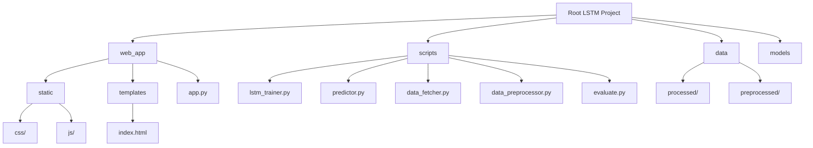

# 📈 NSE Luminary AI: Advanced Stock Price Prediction with CNN-LSTM

> **A next-generation deep learning platform for stock price prediction, blending CNN-LSTM architectures with a modern interactive web dashboard.**


---

<div align="center">
  
  <br>
  <em>Modern dashboard for multi-stock prediction, evaluation, and visualization</em>
</div>

---

## ✨ Overview

NSE Luminary AI is a production-grade platform for stock price prediction using a hybrid CNN-LSTM deep learning model. It empowers investors and researchers with:
- Real-time stock data ingestion
- Multi-stock, multi-timeframe predictions
- Interactive web dashboard
- Model evaluation, visualization, and export

<details>
<summary>🌟 <b>Key Highlights</b></summary>

- 🚀 **Hybrid CNN-LSTM Model**: Combines convolutional and recurrent layers for robust time-series forecasting.
- 📊 **Modern Web App**: Responsive, animated dashboard built with Flask, TailwindCSS, and Chart.js.
- 🔒 **Secure, Scalable Backend**: Modular Python codebase, ready for extension and deployment.
- 🧠 **AI/ML Best Practices**: Early stopping, mixed precision, L2 regularization, and volatility-aware prediction.
- 📈 **Rich Visualizations**: Interactive charts, metrics, and comparison tools.

</details>

---


## 🧱 Tech Stack

### Core Technologies
- **Python 3.8+** — Primary programming language
- **PyTorch** — Deep learning framework
- **Flask** — Web application framework
- **Pandas & NumPy** — Data manipulation
- **scikit-learn** — Data preprocessing and evaluation
- **yfinance** — Financial data collection
- **Chart.js** — Data visualization (web dashboard)
- **TailwindCSS** — Modern UI styling

### Development Tools
- Git — Version control
- Virtual Environment — Dependency management
- Jupyter Notebook — For experimentation and analysis

---

## 🗂️ Project Structure

```text
LSTM/
├── web_app/                  # Flask web application
│   ├── static/               # Static files (CSS, JS, images)
│   │   ├── css/              # Custom stylesheets
│   │   └── js/               # JavaScript for interactivity
│   ├── templates/            # HTML Jinja templates
│   │   └── index.html        # Main dashboard UI
│   ├── app.py                # Main Flask app (API + routing)
│   └── logs/                 # Web app logs
├── scripts/                  # Core Python scripts
│   ├── lstm_trainer.py       # Model training (CNN-LSTM)
│   ├── predictor.py          # Prediction logic (inference)
│   ├── data_fetcher.py       # Fetches raw stock data (yfinance)
│   ├── data_preprocessor.py  # Cleans & preprocesses data
│   ├── evaluate.py           # Model evaluation metrics
│   └── logs/                 # Training logs
├── data/                     # Stock data storage
│   ├── processed/            # Cleaned CSVs (per stock)
│   └── preprocessed/         # NPY arrays, scalers (per stock)
├── models/                   # Trained PyTorch model files (.pt)
├── requirements.txt          # Python dependencies
└── README.md                 # Project documentation
```

### 📦 Visual Project Structure (Mermaid)



#### 🗃️ Directory Relationships
- **web_app/**: Everything for the web dashboard and API
- **scripts/**: All ML, data, and evaluation logic
- **data/**: Raw, processed, and preprocessed stock data
- **models/**: Saved PyTorch models (per stock)

---

### 🧭 Data Flow Diagram (Mermaid)

```mermaid
flowchart LR
    subgraph Data_Pipeline
      A1[Raw CSVs<br>data/processed/] --> A2[Preprocessing<br>scripts/data_preprocessor.py]
      A2 --> A3[Preprocessed NPYs<br>data/preprocessed/]
      A3 --> A4[Model Training<br>scripts/lstm_trainer.py]
      A4 --> A5[Trained Models<br>models/*.pt]
    end
    A5 --> B1[Prediction<br>scripts/predictor.py]
    B1 --> C1[API (web_app/app.py)]
    C1 --> D1[Web Dashboard (index.html)]
```

---

## 🚀 Features

- **Hybrid CNN-LSTM Model** for time-series forecasting
- **Multi-stock, multi-timeframe** prediction
- **Interactive dashboard** with metrics, charts, and export
- **Real-time data ingestion** from yfinance
- **Volatility-aware predictions** (noise injection)
- **Model evaluation:** MSE, RMSE, MAE, R²
- **Production-ready backend** (modular scripts, logging)
- **Modern, responsive UI** (dark/light mode)

---

## 🛠️ Installation

```bash
# 1. Clone repository
$ git clone https://github.com/yourusername/Stock-Price-Prediction.git
$ cd Stock-Price-Prediction

# 2. Create and activate virtual environment
$ python -m venv lstm_venv
$ .\lstm_venv\Scripts\activate  # Windows
# Or: source lstm_venv/bin/activate  # Linux/Mac

# 3. Install dependencies
$ pip install -r requirements.txt

# 4. (Optional) Set environment variables
$ echo FLASK_APP=web_app/app.py > .env
$ echo FLASK_ENV=development >> .env
```

---

## 📊 Usage

### Train the Model
```bash
python scripts/lstm_trainer.py
```

### Run the Web App
```bash
flask run
# Open http://127.0.0.1:5000
```

### Predict Stock Prices
- Select a stock symbol
- Choose prediction days
- View interactive charts and metrics

---

## 🎬 Demo

<div align="center">
  
  <br>
  <em>📸 <b>Dashboard Screenshot</b> (replace with your own)</em>
</div>

---

## 🏛️ System Architecture

```mermaid
flowchart TD
    A[User] -->|Web Browser| B(Flask Web App)
    B --> C[Predict API]
    B --> D[Original Data API]
    B --> E[Evaluate API]
    C --> F[Predictor Script]
    D --> G[CSV Data]
    F --> H[Preprocessed Data]
    F --> I[Trained Model (PyTorch)]
    E --> J[Evaluation Script]
    J --> I
    B --> K[HTML Templates + Chart.js]
```

---

## 🧬 Model Architecture (Mermaid)

```mermaid
flowchart LR
    X[Input Sequence] --> Y[Conv1D + BN + ReLU]
    Y --> Z[MaxPool]
    Z --> A1[Conv1D + BN + ReLU]
    A1 --> A2[MaxPool]
    A2 --> B1[LSTM Layer 1 + Dropout]
    B1 --> B2[LSTM Layer 2 + Dropout]
    B2 --> C1[Dense (ReLU)]
    C1 --> C2[Dense (Output)]
    C2 --> O[Predicted Price]
```

---

## 🔌 API Endpoints

| Endpoint                      | Method | Description                             |
|-------------------------------|--------|-----------------------------------------|
| `/`                           | GET    | Dashboard (list stocks)                 |
| `/predict/<stock>/<days>`     | GET    | Predict future prices for stock         |
| `/original/<stock>?days=N`    | GET    | Get original stock data (last N days)   |
| `/evaluate/<stock>`           | GET    | Get model evaluation metrics            |

**Example:**
```bash
curl http://127.0.0.1:5000/predict/RELIANCE/30
```

---

## 🔒 Security & Authentication

> **Note:** No authentication is implemented by default. For production, consider adding:
- User authentication (Flask-Login, OAuth)
- API key/token protection
- HTTPS deployment
- Input validation & rate limiting

---

## 🧪 Testing

- Unit tests can be added for model, data, and API scripts (pytest recommended)
- Manual testing via the dashboard and API endpoints
- (Optional) Add CI workflow for automated tests

---

## 📚 Dataset

- **Source:** [yfinance](https://pypi.org/project/yfinance/) (NSE/BSE stocks)
- **Processed:** CSVs in `data/processed/`
- **Preprocessed:** Numpy arrays, scalers in `data/preprocessed/`
- **Features:** Close price, technical indicators (extendable)

---

## 🤖 AI/ML Details

- **Model:** CNN-LSTM hybrid (see architecture above)
- **Training:** Early stopping, mixed precision, L2 regularization
- **Prediction:** Volatility noise injection for realism
- **Evaluation:** MSE, RMSE, MAE, R² metrics

---

## 🧩 Algorithms & Logic

- **CNN Layers:** Feature extraction from time-series
- **LSTM Layers:** Sequence learning for temporal dependencies
- **Dense Layers:** Regression output
- **Noise Injection:** Adds historical volatility to predictions

---

## ⚙️ Configuration

<details>
<summary>Click to expand</summary>

- Most paths and settings are hardcoded in scripts (see `scripts/` and `web_app/app.py`)
- For advanced config, refactor to use environment variables or a config file
- Example `.env`:
  ```env
  FLASK_APP=web_app/app.py
  FLASK_ENV=development
  DATA_DIR=data/
  MODEL_DIR=models/
  ```
</details>

---

## 🔄 CI/CD Workflow

- No CI/CD by default. Recommended:
  - GitHub Actions for linting, testing, and deployment
  - Dockerize the app for reproducible builds

---

## ❓ FAQ

<details>
<summary>Click to expand</summary>

**Q: Can I use this for live trading?**
- No, this is for research/education only. Real trading requires more robust systems.

**Q: Can I add more stocks or indicators?**
- Yes! Add CSVs to `data/processed/` and retrain. Extend `data_preprocessor.py` for more features.

**Q: Is GPU required?**
- Recommended for training, not strictly required for inference.

**Q: How do I contribute?**
- See the [Contributing](#-contributing) section below.

</details>

---

## 🌱 Future Improvements

- [ ] Add more technical indicators
- [ ] Sentiment analysis from news/social
- [ ] Multi-stock comparison
- [ ] Automated model retraining
- [ ] User authentication & portfolio tracking

---

## 🤝 Contributing

1. Fork the repository
2. Create a feature branch (`git checkout -b feature/AmazingFeature`)
3. Commit your changes (`git commit -m 'Add some AmazingFeature'`)
4. Push to the branch (`git push origin feature/AmazingFeature`)
5. Open a Pull Request

---

## 📜 License

Distributed under the MIT License. See `LICENSE` for details.

---

## 🙏 Credits

- [PyTorch](https://pytorch.org/)
- [yfinance](https://pypi.org/project/yfinance/)
- [Flask](https://flask.palletsprojects.com/)
- [scikit-learn](https://scikit-learn.org/)
- [Chart.js](https://www.chartjs.org/)
- [TailwindCSS](https://tailwindcss.com/)

---

## 📬 Contact

**Your Name**  
[LinkedIn](https://www.linkedin.com/in/yourprofile) • [Twitter](https://twitter.com/yourtwitter) • your.email@example.com

---

<div align="center">
  Made with ❤️ by Your Name  
  <br>
  <sub>Optimized for technical recruiters & open-source contributors</sub>
</div>

---

## 🏅 Badges


---

## 🧩 Extras

- Add your own screenshots, GIFs, and diagrams in `docs/assets/`
- For advanced deployment, see [Flask deployment options](https://flask.palletsprojects.com/en/latest/deploying/)
- For questions, open an [issue](https://github.com/yourusername/Stock-Price-Prediction/issues)

## 🤝 Contributing

Contributions are welcome! Please follow these steps:
1. Fork the repository
2. Create a feature branch (`git checkout -b feature/AmazingFeature`)
3. Commit your changes (`git commit -m 'Add some AmazingFeature'`)
4. Push to the branch (`git push origin feature/AmazingFeature`)
5. Open a Pull Request

## 📜 License

Distributed under the MIT License. See `LICENSE` for more information.

## 📬 Contact

Your Name - [@yourtwitter](https://twitter.com/yourtwitter) - your.email@example.com

Project Link: [https://github.com/yourusername/Stock-Price-Prediction](https://github.com/yourusername/Stock-Price-Prediction)

## 🙏 Acknowledgments

- [PyTorch](https://pytorch.org/) for the amazing deep learning framework
- [yfinance](https://pypi.org/project/yfinance/) for financial data
- [Flask](https://flask.palletsprojects.com/) for the web framework
- [scikit-learn](https://scikit-learn.org/) for data preprocessing and metrics

## 📌 Future Improvements

- [ ] Add more technical indicators as features
- [ ] Implement sentiment analysis from news and social media
- [ ] Add support for multiple stocks comparison
- [ ] Implement automated model retraining
- [ ] Add user authentication and portfolio tracking

---

<div align="center">
  Made with ❤️ by Your Name
</div>
